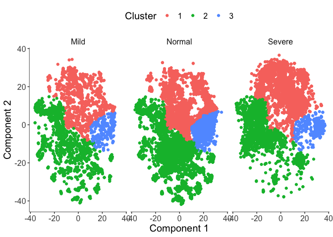

Nami Niyakan

## scBALF Covid-19 data analysis with Monocle

Setting up monocle model by using the normal distribution.
(exexpressionFamily=uninormal(), default is the negativeBinomial)

``` r
knitr::opts_chunk$set(cache = TRUE)
library(monocle)
```

    ## Loading required package: Matrix

    ## Loading required package: Biobase

    ## Loading required package: BiocGenerics

    ## Loading required package: parallel

    ## 
    ## Attaching package: 'BiocGenerics'

    ## The following objects are masked from 'package:parallel':
    ## 
    ##     clusterApply, clusterApplyLB, clusterCall, clusterEvalQ,
    ##     clusterExport, clusterMap, parApply, parCapply, parLapply,
    ##     parLapplyLB, parRapply, parSapply, parSapplyLB

    ## The following objects are masked from 'package:stats':
    ## 
    ##     IQR, mad, sd, var, xtabs

    ## The following objects are masked from 'package:base':
    ## 
    ##     anyDuplicated, append, as.data.frame, basename, cbind, colnames,
    ##     dirname, do.call, duplicated, eval, evalq, Filter, Find, get, grep,
    ##     grepl, intersect, is.unsorted, lapply, Map, mapply, match, mget,
    ##     order, paste, pmax, pmax.int, pmin, pmin.int, Position, rank,
    ##     rbind, Reduce, rownames, sapply, setdiff, sort, table, tapply,
    ##     union, unique, unsplit, which.max, which.min

    ## Welcome to Bioconductor
    ## 
    ##     Vignettes contain introductory material; view with
    ##     'browseVignettes()'. To cite Bioconductor, see
    ##     'citation("Biobase")', and for packages 'citation("pkgname")'.

    ## Loading required package: ggplot2

    ## Loading required package: VGAM

    ## Loading required package: stats4

    ## Loading required package: splines

    ## Loading required package: DDRTree

    ## Loading required package: irlba

``` r
library(dplyr)
```

    ## 
    ## Attaching package: 'dplyr'

    ## The following object is masked from 'package:Biobase':
    ## 
    ##     combine

    ## The following objects are masked from 'package:BiocGenerics':
    ## 
    ##     combine, intersect, setdiff, union

    ## The following objects are masked from 'package:stats':
    ## 
    ##     filter, lag

    ## The following objects are masked from 'package:base':
    ## 
    ##     intersect, setdiff, setequal, union

``` r
data<-read.csv(file = "/Users/Nami/Documents/hackathon/covid-selected-data.csv")
data<-as.matrix(data)
rownames(data)<-data[,1]
data<-data[,-1]
n<-rownames(data)
data<-apply(data,2,as.numeric)
rownames(data)<-n
data<-t(data)
dim(data)
```

    ## [1]  1999 23189

``` r
true_lables<-read.csv(file="/Users/Nami/Documents/hackathon/covid-selected-data-labels.csv")
true_lables<-as.matrix(true_lables)
rownames(true_lables)<-true_lables[,1]
true_lables<-true_lables[,-1]
n<-rownames(data)
rownames(data)<-n
true_lables<-as.matrix(true_lables)
colnames(true_lables)<-c("cell_type")
true_lables<-as.data.frame(true_lables)
summary(as.factor(true_lables$cell_type))
```

    ##   Mild Normal Severe 
    ##   3292  11978   7919

``` r
true_lables<-true_lables %>% mutate(Nor_vs_rest = case_when(
  cell_type == c("Normal") ~ "Normal",
  cell_type != c("Normal") ~ "Rest"))

true_lables<-true_lables %>% mutate(Sev_vs_rest = case_when(
  cell_type == c("Severe") ~ "Severe",
  cell_type != c("Severe") ~ "Rest"))

true_lables<-true_lables %>% mutate(Mil_vs_rest = case_when(
  cell_type == c("Mild") ~ "Mild",
  cell_type != c("Mild") ~ "Rest"))


features<-matrix(0,nrow(data),1)
colnames(features)<-c("gene_short_name")
rownames(features)<-rownames(data)
features[,1]<-rownames(data)
features<-as.data.frame(features)
```

``` r
pd <- new("AnnotatedDataFrame", data = true_lables)
fd <- new("AnnotatedDataFrame", data = features)
covid <- newCellDataSet(as.matrix(data),
                       phenoData = pd, featureData = fd,expressionFamily=uninormal(),lowerDetectionLimit = -50)
```

## Dimension Reduction using tSNE and cell clustering (densityPeak)

``` r
knitr::opts_chunk$set(cache = TRUE)
covid <- reduceDimension(covid, max_components = 2, num_dim = 50,
                         norm_method = 'none',
                        reduction_method = 'tSNE',
                        residualModelFormulaStr = "~cell_type",
                        verbose = F)
covid <- clusterCells(covid, num_clusters = 4)
```

    ## Distance cutoff calculated to 3.921775

``` r
plot_cell_clusters(covid, 1, 2, color = "cell_type")
```

<!-- -->

``` r
plot_cell_clusters(covid, 1, 2, color = "Cluster")
```

<!-- -->

``` r
plot_cell_clusters(covid, 1, 2, color = "Cluster") +
  facet_wrap(~cell_type)
```

<!-- -->

## Dimension Reduction using tSNE and cell clustering(densityPeak)

This time used 200 principal components instead of 50 in the initial PCA
to see whether results change or not. Also removed adding pseudo
expression and relative expression options.

``` r
covid <- reduceDimension(covid, max_components = 2, num_dim = 200,
                         norm_method = 'none',
                        reduction_method = 'tSNE',
                        pseudo_expr = 0,
                        relative_expr = FALSE,
                        residualModelFormulaStr = "~cell_type",
                        verbose = F)
covid <- clusterCells(covid, num_clusters = 4)
```

    ## Distance cutoff calculated to 4.707604

``` r
plot_cell_clusters(covid, 1, 2, color = "cell_type")
```

<!-- -->

``` r
plot_cell_clusters(covid, 1, 2, color = "Cluster")
```

<!-- -->

``` r
plot_cell_clusters(covid, 1, 2, color = "Cluster") +
  facet_wrap(~cell_type)
```

<!-- -->

## Dimension Reduction using tSNE and cell clustering(Louvain with K=1000 in knn)

``` r
covid <- reduceDimension(covid, max_components = 2, num_dim = 50,
                         norm_method = 'none',
                        reduction_method = 'tSNE',
                        pseudo_expr = 0,
                        residualModelFormulaStr = "~cell_type",
                        relative_expr = FALSE,
                        verbose = F)
covid <- clusterCells(covid, method = 'louvain',k=1000)
plot_cell_clusters(covid, 1, 2, color = "cell_type")
```

<!-- -->

``` r
plot_cell_clusters(covid, 1, 2, color = "Cluster")
```

<!-- -->

``` r
plot_cell_clusters(covid, 1, 2, color = "Cluster") +
  facet_wrap(~cell_type)
```

<!-- -->

## Differential Expression Analysis between Normal cells and the rest (Mild + Severe)

``` r
marker_genes <- row.names(subset(fData(covid),
                                 gene_short_name %in% gene_short_name))
diff_test_res_Nor <- differentialGeneTest(covid[marker_genes,],
                                      fullModelFormulaStr = "~Nor_vs_rest")
```

    ## Warning in if (isSparseMatrix(exprs(X))) {: the condition has length > 1 and
    ## only the first element will be used

``` r
Ordered_diff_test_res_Nor<- diff_test_res_Nor[order(diff_test_res_Nor$qval),]
head(Ordered_diff_test_res_Nor,20)
```

    ##            status    family          pval          qval gene_short_name
    ## SFTA2          OK uninormal  0.000000e+00  0.000000e+00           SFTA2
    ## RSAD2          OK uninormal  0.000000e+00  0.000000e+00           RSAD2
    ## IL21           OK uninormal  0.000000e+00  0.000000e+00            IL21
    ## PEG10          OK uninormal  0.000000e+00  0.000000e+00           PEG10
    ## IGHV3.69.1     OK uninormal  0.000000e+00  0.000000e+00      IGHV3.69.1
    ## SPON1          OK uninormal  0.000000e+00  0.000000e+00           SPON1
    ## IFNL2          OK uninormal  0.000000e+00  0.000000e+00           IFNL2
    ## SLAMF7         OK uninormal 1.449616e-314 3.622228e-312          SLAMF7
    ## ADGRF5         OK uninormal 1.859501e-303 4.130158e-301          ADGRF5
    ## CCL8           OK uninormal 2.451960e-299 4.901469e-297            CCL8
    ## CALHM6         OK uninormal 2.524630e-296 4.587941e-294          CALHM6
    ## RGL1           OK uninormal 1.053695e-294 1.755280e-292            RGL1
    ## CD52           OK uninormal 3.650429e-292 5.613237e-290            CD52
    ## CXCL10         OK uninormal 1.639982e-280 2.341661e-278          CXCL10
    ## IL4I1          OK uninormal 9.500626e-234 1.266117e-231           IL4I1
    ## IGFL2          OK uninormal 7.227738e-230 9.030155e-228           IGFL2
    ## IDO1           OK uninormal 1.018266e-228 1.197361e-226            IDO1
    ## GCH1           OK uninormal 3.012913e-210 3.346008e-208            GCH1
    ## CXCL11         OK uninormal 1.412945e-209 1.486566e-207          CXCL11
    ## SFTPB          OK uninormal 2.271687e-209 2.270551e-207           SFTPB

## Differential Expression Analysis between Severe cells and the rest (Mild + Normal)

``` r
diff_test_res_Sev <- differentialGeneTest(covid[marker_genes,],
                                      fullModelFormulaStr = "~Sev_vs_rest")
```

    ## Warning in if (isSparseMatrix(exprs(X))) {: the condition has length > 1 and
    ## only the first element will be used

``` r
Ordered_diff_test_res_Sev<- diff_test_res_Sev[order(diff_test_res_Sev$qval),]
head(Ordered_diff_test_res_Sev,20)
```

    ##            status    family          pval          qval gene_short_name
    ## SFTA2          OK uninormal  0.000000e+00  0.000000e+00           SFTA2
    ## IL21           OK uninormal  0.000000e+00  0.000000e+00            IL21
    ## PEG10          OK uninormal  0.000000e+00  0.000000e+00           PEG10
    ## SLAMF7         OK uninormal  0.000000e+00  0.000000e+00          SLAMF7
    ## IGHV3.69.1     OK uninormal  0.000000e+00  0.000000e+00      IGHV3.69.1
    ## SPON1          OK uninormal  0.000000e+00  0.000000e+00           SPON1
    ## IFNL2          OK uninormal  0.000000e+00  0.000000e+00           IFNL2
    ## RGL1           OK uninormal 4.481175e-321 1.119736e-318            RGL1
    ## ADGRF5         OK uninormal 1.429792e-310 3.175728e-308          ADGRF5
    ## CD52           OK uninormal 9.357917e-306 1.870648e-303            CD52
    ## CRYBA4         OK uninormal 5.007260e-296 9.099557e-294          CRYBA4
    ## CALHM6         OK uninormal 3.441490e-295 5.732949e-293          CALHM6
    ## CTSB           OK uninormal 1.118941e-289 1.720586e-287            CTSB
    ## LGMN           OK uninormal 5.206730e-284 7.434467e-282            LGMN
    ## CCL8           OK uninormal 5.009365e-275 6.675813e-273            CCL8
    ## IGFL2          OK uninormal 3.977379e-256 4.969238e-254           IGFL2
    ## SDS            OK uninormal 2.512973e-236 2.954961e-234             SDS
    ## RSAD2          OK uninormal 2.981957e-233 3.311628e-231           RSAD2
    ## SFTPB          OK uninormal 8.618039e-230 9.067084e-228           SFTPB
    ## HKDC1          OK uninormal 5.975868e-228 5.972880e-226           HKDC1

Intersection of top 100 DE genes between two analysis(Normal vs Rest &
Severe vs Rest):

``` r
intersect(Ordered_diff_test_res_Nor$gene_short_name[1:100],Ordered_diff_test_res_Sev$gene_short_name[1:100])
```

    ##  [1] "SFTA2"      "RSAD2"      "IL21"       "PEG10"      "IGHV3.69.1"
    ##  [6] "SPON1"      "IFNL2"      "SLAMF7"     "ADGRF5"     "CCL8"      
    ## [11] "CALHM6"     "RGL1"       "CD52"       "CXCL10"     "IL4I1"     
    ## [16] "IGFL2"      "IDO1"       "GCH1"       "CXCL11"     "SFTPB"     
    ## [21] "FABP4"      "SFTA1P"     "SGK1"       "GJA1"       "HKDC1"     
    ## [26] "CRYBA4"     "GBP5"       "MARCKS"     "CD3E"       "ANKRD22"   
    ## [31] "CTSE"       "SFN"        "CCL3"       "S100A14"    "PFKFB3"    
    ## [36] "SDS"        "LGMN"       "KRT7"       "CYR61"      "IFIT1"     
    ## [41] "CTSB"       "CTSL"       "SAA2.SAA4"  "ATF5"       "IFNL3"     
    ## [46] "GBP1"       "GBP4"       "TRAV38.1"   "CCL2"       "TSHZ2"     
    ## [51] "CCL4"       "NINJ1"      "CD38"       "MAL2"       "ALOX5AP"   
    ## [56] "CD7"        "SPRR1B"     "MAFB"       "TRBV7.4"    "ATF3"      
    ## [61] "RNASE7"     "CXCL9"      "GZMA"       "FBXW10"     "KRT16"     
    ## [66] "IGFBP4"     "FGL2"       "KRTAP3.1"   "CLDN3"      "LAMC2"     
    ## [71] "PLA2G7"     "MARCO"      "IER3"       "NUPR1"      "CD2"       
    ## [76] "PTPRCAP"    "SPHK1"      "ICAM1"      "TMPRSS11D"  "CD247"     
    ## [81] "IGHV5.51"   "SPOCK2"     "CEACAM7"    "CD48"       "SFTPA2"    
    ## [86] "CCR4"       "SPP1"       "LYZ"

## Differential Expression Analysis between Mild cells and the rest (Severe + Normal)

``` r
diff_test_res_Mil <- differentialGeneTest(covid[marker_genes,],
                                      fullModelFormulaStr = "~Mil_vs_rest")
```

    ## Warning in if (isSparseMatrix(exprs(X))) {: the condition has length > 1 and
    ## only the first element will be used

``` r
Ordered_diff_test_res_Mil<- diff_test_res_Mil[order(diff_test_res_Mil$qval),]
head(Ordered_diff_test_res_Mil,20)
```

    ##          status    family         pval         qval gene_short_name
    ## S100A12      OK uninormal 6.423043e-60 1.283966e-56         S100A12
    ## APOBEC3A     OK uninormal 2.079391e-57 2.078351e-54        APOBEC3A
    ## IFITM1       OK uninormal 3.372803e-57 2.247411e-54          IFITM1
    ## ISG20        OK uninormal 2.185787e-52 1.092347e-49           ISG20
    ## FFAR2        OK uninormal 5.085145e-47 2.033041e-44           FFAR2
    ## CXCL10       OK uninormal 1.913961e-38 6.376679e-36          CXCL10
    ## C1QA         OK uninormal 5.749340e-38 1.641847e-35            C1QA
    ## IFITM2       OK uninormal 8.128937e-38 2.031218e-35          IFITM2
    ## TNFSF10      OK uninormal 2.912852e-37 6.469768e-35         TNFSF10
    ## C1QB         OK uninormal 8.051054e-37 1.609406e-34            C1QB
    ## ACOD1        OK uninormal 2.416125e-36 4.390757e-34           ACOD1
    ## IL1RN        OK uninormal 4.063686e-35 6.769424e-33           IL1RN
    ## S100A8       OK uninormal 6.588159e-35 1.013056e-32          S100A8
    ## S100A9       OK uninormal 2.363316e-32 3.374478e-30          S100A9
    ## CLU          OK uninormal 3.262519e-32 4.347850e-30             CLU
    ## C1QC         OK uninormal 3.222701e-31 4.026363e-29            C1QC
    ## MT.CO1       OK uninormal 2.657904e-29 3.125382e-27          MT.CO1
    ## RSAD2        OK uninormal 1.461743e-27 1.623347e-25           RSAD2
    ## FCN1         OK uninormal 5.606043e-27 5.898147e-25            FCN1
    ## MT1M         OK uninormal 6.979913e-27 6.976423e-25            MT1M

Intersection of top 100 DE genes between all three analysis:

``` r
intersect(intersect(Ordered_diff_test_res_Nor$gene_short_name[1:100],Ordered_diff_test_res_Sev$gene_short_name[1:100]),Ordered_diff_test_res_Mil$gene_short_name[1:100])
```

    ##  [1] "RSAD2"  "CXCL10" "IDO1"   "GCH1"   "CXCL11" "CRYBA4" "CCL3"   "LGMN"  
    ##  [9] "IFIT1"  "CTSB"   "GBP1"   "CCL2"
